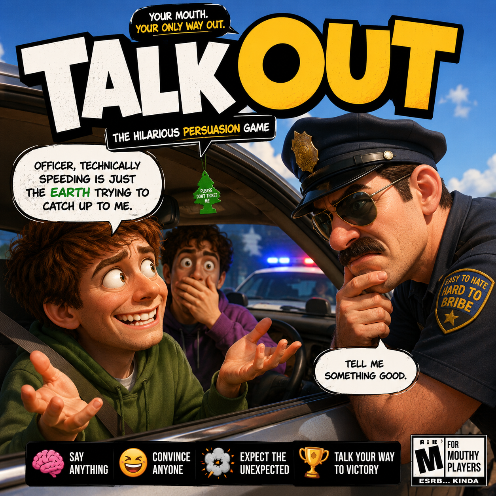

# Talk Out

  

A first-person comedy persuasion game: you've been pulled over, and you talk —
literally, into your microphone — until the cop lets you go. Everything runs
**locally**: the cop is an LLM speaking freely in character, a second **judge LLM**
watches the transcript and rules when you've actually talked your way out,
Whisper transcribes your voice, and Windows TTS gives the cop a voice.

**Scenario 001: Traffic Stop** — Officer Glazer at your window, your friend Benny
sweating in the passenger seat, and a glove box you probably shouldn't open.

## Setup (fresh clone)

1. Open with **Unity 2022.3.62f3** (packages restore automatically: LLMUnity,
   whisper.unity, Post Processing, Newtonsoft).
2. Download the two models into `Assets/StreamingAssets/Models/` — see the
   README there (Dolphin 3.0 Llama 3.1 8B GGUF ~4.9 GB + Whisper base.en ~148 MB, both gitignored).
3. In Unity: **Tools → TalkOut → Build Everything (Graphics + Textures + Assets + Scenes)**.
4. Open `Assets/Scenes/TrafficStop.unity`, press **Play**.

## How to play

- **Mouse** — look around from the driver's seat. **Esc** frees the cursor.
- **Hold V** — talk into your mic (local Whisper transcription).
- **Enter** — type instead of talking.
- **Click** things: glove box, horn, radio, sunglasses, your license. Everything
  you do lands in the scene's memory — the cop may comment, and the judge remembers.
- **Goal**: get the officer to *say* you can go. He decides. The judge confirms it.
- **F1** — referee debug view (phase, last judge verdict, LLM transcript).
  **F9** — scripted test-corpus run.

## Architecture

- `Core/EventLog` — the single scene memory: speech, actions, beats. Both LLMs
  read the same transcript.
- `Director/LlmCopBrain` — freeform in-character dialogue (no JSON constraints).
- `Director/LlmJudge` — grammar-constrained ruling `{released, arrested, cop_mood,
  actions[]}`; actions come only from the scenario's approved catalog. Injection-safe
  by design: the judge is told to rule only from what the OFFICER says.
- `Core/TurnController` — opener → player speech/interaction → cop reply → judge
  ruling → physical beats → outcome.
- `Player/` — first-person rig, crosshair interaction raycaster, clickable
  `Interactable`s, Whisper push-to-talk.
- `Audio/` — SAPI TTS (`SapiVoice`) + `NpcSpeaker` (drives talking wobble).
- `Actors/WobbleAnimator` — inflatable-tube-man body language; arms are
  physics-jointed and flop on their own.
- `Scripts/Editor` — `Tools/TalkOut/*` rebuilds everything idempotently.
- Mock brains auto-engage if the GGUF is missing (`GameManager.useMockBrains` forces them).

New scenarios = new ScriptableObject data (opener line, judge guidance, NPCs,
action catalog, props) + a scene. No new core code.

## Models

Swap the LLM via `Assets/GameData/LlmConfig.asset` + the `LLM` component in the
scene; any GGUF chat model works (check its license before shipping — and Steam
requires an AI-content disclosure). Whisper model path is on the `Whisper` object.
TTS voices are Windows SAPI (per-NPC name/rate/pitch on `NpcSpeaker`).
